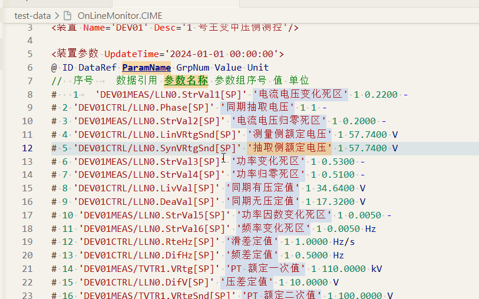

# CimE Language Support

VS Code 的 CIM/E 文件支持扩展，适用于阅读 `.CIME` 和 `.cime` 文件。

## 功能

- 识别 CIM/E 文件并提供语法着色
- 折叠成对标签和数据块
- 使用 Sticky Scroll 固定当前数据块的标签、表头和字段说明
- 分隔符可视化：空格显示为 `·`、Tab 显示为 `→`（仅对 CIME 文件启用，便于核对字段分隔）
- 十字定位：光标置于任意数据字段时——
  - 当前行淡色背景、当前字段橙色背景
  - 表头 `@` 行与注释 `//` 行对应字段高亮（吸顶后仍以加粗+下划线显示，随列切换实时刷新）
  - 可视范围内同列其他数据行淡色背景
  - 状态栏显示当前列号与字段名（如 `CIME 第 2/6 列：DataRef · 数据引用`）
- 支持中文标签、`<类名::实体名>` 和 OnLineMonitor 常见写法
- 兼容 GB/T 30149—2013、GB/T 30149—2019 常见结构（横表、纵表）

## 使用

安装扩展后直接打开 CIM/E 文件即可。

Sticky Scroll 默认启用。如果编辑器顶部没有显示当前数据块信息，请在设置中开启 `Editor: Sticky Scroll Enabled`，或从命令面板运行 `View: Toggle Sticky Scroll`。

分隔符可视化默认对所有 CIME 文件启用（`editor.renderWhitespace: all`），可在设置的 `[cime]` 语言作用域中调整。Tab 宽度固定为 4（`tabSize`），如需修改同样在 `[cime]` 作用域设置。

## 说明

扩展只做阅读辅助，不修改文件内容。

当前版本暂不提供语义校验、自动补全、格式化和格式转换。

问题和未覆盖的文件写法可以提交到 [GitHub Issues](https://github.com/Songyanglin-curious/CimE-Language-Support/issues)。
